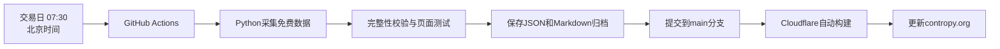

# 每日资讯博弈

面向A股宏观与行业研究的晨间投资看板，辅助1—3个月波段观察。看板整合A股、港股通及海外参考市场数据，重点展示市场环境、宏观利率、行业强度、跨市场情绪、风险压力和未来催化。

**在线地址：[https://contropy.org](https://contropy.org)**

> 本项目用于个人研究和功能验证，不构成投资建议、收益承诺或自动交易信号。免费数据源可能存在延迟、限流、修订及授权范围限制。

## 主要功能

- **市场环境**：A股涨跌家数、涨跌停、成交额、风格强弱、集中度、波动、两融与ETF份额等。
- **港股通与海外参考**：南向资金以及美国、日本、韩国、欧洲市场表现。
- **宏观与利率**：国内经济运行、货币条件、利率及海外金融环境。
- **行业跟踪**：行业RPS、成交占比、波动率、拥挤度和龙头集中度。
- **风险与情绪**：A股、美股、亚洲和欧洲情绪，以及全球波动、信用和金融压力。
- **未来催化**：未来7、30和90日的重要宏观、政策和行业事件。
- **机会保护机制**：只有当前瞻、估值和行情覆盖达到门槛时才生成波段行业Top 3，避免为凑数输出低可信信号。
- **长期归档**：每日保存JSON快照与Markdown日报，便于后续历史比较和复盘。

## 每日更新方式

网站更新不依赖个人电脑或Codex保持在线，全部由GitHub和Cloudflare在云端执行。



- 定时任务每周一至周五07:30启动，并再次校验是否为A股交易日。
- 07:30时A股尚未开盘，因此A股行情使用上一已完成交易日；海外和宏观指标使用当时已发布的最新有效值。
- 数据或构建校验失败时不会发布，新网站继续显示上一份有效日报。
- 自动化定义见 [`.github/workflows/daily-dashboard.yml`](.github/workflows/daily-dashboard.yml)。

## 技术框架

| 层级 | 技术 | 用途 |
|---|---|---|
| 页面 | React 19 + TypeScript | 看板组件与指标展示 |
| Web框架 | vinext + Vite 8 | 服务端渲染、构建和资源打包 |
| 托管 | Cloudflare Workers | 正式网站运行与全球分发 |
| 采集 | Python 3.11 + AKShare + pandas + requests | 免费数据源采集、整理和计算 |
| 自动化 | GitHub Actions | 交易日定时采集、校验、归档和提交 |
| 数据存储 | JSON + Markdown + Git | 当前快照、不可覆盖的历史快照和日报 |

当前版本不依赖常驻数据库；页面在构建时读取 [`data/current-snapshot.json`](data/current-snapshot.json)。每次新快照提交到`main`后，Cloudflare自动重新构建网站。

## 本地运行

环境要求：

- Node.js `>=22.13.0`
- Python `>=3.11`

安装与启动：

```bash
git clone https://github.com/liao497/contropy-site.git
cd contropy-site

npm ci
python3 -m venv .venv
source .venv/bin/activate
python -m pip install -r requirements-data.txt

npm run dev
```

开发服务器启动后，按终端显示的本地地址访问看板。

## 数据采集与验证

手动采集指定报告日：

```bash
python scripts/collect-free-daily.py \
  --date YYYY-MM-DD \
  --output data/current-snapshot.json \
  --revision local
```

验证当前快照与页面：

```bash
npm run validate:snapshot
npm run lint
npm test
```

归档已经校验的快照：

```bash
npm run archive:report -- data/current-snapshot.json .
```

归档文件默认不可覆盖。同一报告日需要修订时，应使用新的`run.revision_id`。

## 项目结构

```text
app/                         看板页面、组件与样式
data/current-snapshot.json   网站当前展示的数据
data/snapshots/              按年/月保存的历史JSON快照
data/schema/                 快照JSON Schema
reports/daily/               按年/月保存的Markdown日报
scripts/                     数据采集、校验与归档脚本
docs/                        指标字典、数据契约和数据源研究
tests/                       页面渲染与归档测试
worker/                      Cloudflare Worker入口
```

## 指标与数据源文档

- [指标字典](docs/indicator-dictionary-v1.md)
- [数据契约](docs/data-contract-v1.md)
- [免费数据源矩阵](docs/free-source-matrix-v2.md)
- [免费数据源验证记录](docs/free-source-validation-2026-08-19.md)
- [Cloudflare与GitHub部署说明](docs/cloudflare-github-deployment.md)

## 部署

生产环境已经连接GitHub `main`分支。合并到`main`后，Cloudflare会自动执行构建并更新 [contropy.org](https://contropy.org)。如需使用本地Wrangler账户手动发布：

```bash
npm run deploy
```

不要把Cloudflare令牌、第三方API Key或其他密钥提交到仓库。

## 联系方式

[liao497@126.com](mailto:liao497@126.com)

## 数据使用说明

“免费数据源”仅表示当前不收取接口调用费，不代表上游行情、指数或宏观数据可以不受限制地商用或再分发。公开部署、商业使用或自动交易前，应分别核验数据许可、指数版权、接口条款和时效性。
